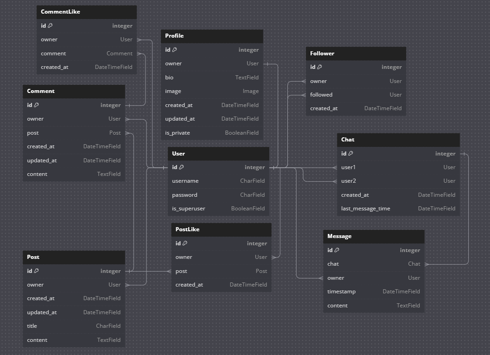

# Socialize API

**Developer: Oğuzhan Akça**

The **Socialize API** is a Django Rest Framework API for social media applications with a focus images. The API is primarily used for the [Socialize](https://github.com/oguzhanakca/socialize-frontend) app, a social media app for posting images and chatting.

[API Link](https://socialize-backend-app-9beed826b5f2.herokuapp.com/)

[Socialize](https://socialize-frontend-app-cfe4edcc8238.herokuapp.com/)

## Table of Contents

- [Features](#features)
    - [Existing Features](#existing-features)
    - [Future Feature Ideas](#future-feature-ideas)
- [Design Process](#design-process)
    - [User Stories](#user-stories)
    - [Data Models](#data-models)
- [API Endpoints](#api-endpoints)
- [Technologies Used](#technologies-used)
    - [Frameworks and Languages](#frameworks-and-languages)
    - [Libraries & Tools](#libraries--tools)
- [Validation](#validation)
- [Credits](#credits)

## Features

### Existing Features

- **User Authentication**: Users can sign up and login. User profiles are automatically created upon sign-up.
- **Profile Settings**: Users can edit their profile image, privacy and bio. They can also change username and password.
- **Posts**: All users can view posts of public profiles. Authenticated users can also view private posts of followed users, edit or delete their own posts. Users can also filter posts by their owner and title.
- **Likes**: Authenticated users can like/unlike the posts and comments that doesnt belong to them.
- **Comments**: Authenticated users can comment on posts.
- **Follows**: Authenticated users can follow each other. Followers can also view private user's posts.
- **Chat**: Authenticated users can view their chat list, send messages to other users and delete those messages.

### Future Feature Ideas

- Allowing to update videos.
- Adding notifications on Like, Comments and Messages.
- Adding more security options to profile like email verifications etc.
- Adding online status of users.

## Design Process

### User Stories

1. As a user, I want to access an API endpoint that allows users to register by providing their username and password.
2. As a user, I want to access an API endpoint that allows users to log in, obtain an authentication token, and access user-specific content.
3. As a user, I want to be able to create, read, update user profiles by using API endpoints.
3. As a user using the API, I want a user profile to be automatically created, when a new user signs up for my application.
4. As a user, I want to be able to create, read, update and delete user posts by using API endpoints.
4. As a user, I want to be able to filter and order user posts.
5. As a user, I want to be able to create, read, update and delete user comments by using API endpoints.
5. As a user, I want to be able to filter user comments on a a specific post.
6. As a user, I want to be able to create, read, update and delete user likes by using API endpoints.
7. As a user, I want to be able to create, read and delete followers by using API endpoints.
7. As a user, I want to be able to filter followers of a specific profile.
8. As a user, I want to be able to create, read and delete chats by using API endpoints.
9. As a user, I want to be able to create, read and delete messages by using API endpoints.
9. As a user, I want to be able to filter all the messages of a specific chat.

### Data Models

#### User Model

- The User model contains information about the user. It is part of the Django allauth library.
- One-to-one relation with the Profile model's owner field
- ForeignKey relation with the Post model's owner
- ForeignKey relation with the Comment model's owner
- ForeignKey relation with the PostLike model's owner
- ForeignKey relation with the CommentLike model's owner
- ForeignKey relation with the Follower model's owner
- ForeignKey relation with the Chat model's user1
- ForeignKey relation with the Chat model's user2
- ForeignKey relation with the Message model's owner

#### Profile Model

- The Profile model contains the following fields: owner, bio, image, created_at, updated_at, is_private
- Used cloudinary for image field.
- One-to-one relation between the owner field and User's id field

#### Post Model

- The Post model contains the following fields: owner, created_at, updated_at, title, content.
- ForeignKey relation with the Comment model's post field.
- ForeignKey relation with the PostLike model's post field.

#### Comment Model

- The Comment model contains the following fields: owner, post,  created_at, updated_at, content.
- ForeignKey relation with the CommentLike model's comment field.

#### PostLike and CommentLike Models

- The PostLike and CommentLike models contain the following fields: owner, post(PostLike), comment(CommentLike), created_at.
- ForeignKey relation with the CommentLike model's comment field.
 
#### Follower Model

- The Follower model contains the following fields: owner, followed, created_at.

#### Chat Model

- The Chat model contains the following fields: user1, user2, created_at, last_message_time.
- ForeignKey relation with the Message model's chat field.

#### Message Model

- The Message model contains the following fields: chat, owner, timestamp, content.

## API Endpoints

The Socialize API provides the following endpoints:

| Endpoint | HTTP Method | CRUD | View Type | Permissions |
|---|---|---|---|---|
| **Authentication and Profiles** |
| /api-auth/login/ | GET | N/A | N/A | Public |  |
|  | POST | N/A | N/A | Public |  |
| /api-auth/logout/ | GET | N/A | N/A | Public |  |
| /dj-rest-auth/registration/ | POST | N/A | N/A | Public |  |
| /dj-rest-auth/login/ | POST | N/A | N/A | Public |  |
| /dj-rest-auth/logout/ | POST | N/A | N/A | Authenticated |  |
| /profiles/ | GET | Read | List | Public |
| /profiles/\<int:pk\>/ | GET | Read | Detail | Public |  |
|  | PUT | Update | Detail | Owner |  |
| **Posts Endpoints** |
| /posts/ | GET | Read | List | Public |
|  | POST | Create | List | Authenticated |  |
| /posts/\<int:pk\>/ | GET | Read | Detail | Public |  |
|  | PUT | Update | Detail | Owner |  |
|  | DELETE | Delete | Detail | Owner |  |
| **Likes Endpoints** |
| /postlikes/ | GET | Read | List | Public |  |
|  | POST | Create | List | Authenticated |  |
| /postlikes/\<int:pk\>/ | GET | Read | Detail | Public |  |
|  | DELETE | Delete | Detail | Owner |  |
| /commentlikes/ | GET | Read | List | Public |  |
|  | POST | Create | List | Authenticated |  |
| /commentlikes/\<int:pk\>/ | GET | Read | Detail | Public |  |
|  | DELETE | Delete | Detail | Owner |  |
| **Comments Endpoints** |
| /comments/ | GET | Read | List | Public |
|  | POST | Create | List | Authenticated |  |
| /comments/\<int:pk\>/ | GET | Read | Detail | Public |  |
|  | PUT | Update | Detail | Owner |  |
|  | DELETE | Delete | Detail | Owner |  |
| **Followers Endpoints** |
| /followers/ | GET | Read | List | Public |  |
|  | POST | Create | List | Authenticated |  |
| /followers/\<int:pk>/ | GET | Read | Detail | Public |  |
|  | DELETE | Delete | Detail | Owner |  |
| **Chat Endpoints** |
| /chats/ | GET | Read | List | Authenticated |  |
|  | POST | Create | List | Authenticated |  |
| /chats/\<int:pk\> | GET | Read | Detail | Participant |  |
|  | DELETE | Delete | Detail | Participant |  |
| chats/\<int:chat_id>\/messages/ | GET | Read | List | Participant |  |
| messages/\<int:pk>\/ | GET | Read | Detail | Owner |  |
|  | DELETE | Delete | Detail | Owner |  |

## Technologies Used

### Frameworks and Languages

- Python
- Django
- Django Rest Framework

### Libraries & Tools

- [Am I Responsive](http://ami.responsivedesign.is/)
- [GitHub](https://github.com/)
- [Heroku Platform](https://id.heroku.com/login)
- [Postgres](https://www.postgresql.org/)
- [Allauth](https://docs.allauth.org/en/latest/)
- [CI Python Linter](https://pep8ci.herokuapp.com/)

## Validation
[CI Python Linter](https://pep8ci.herokuapp.com/) from Code Institute used for validation. All errors are fixed.

## Testing

**Test** | **Action** | **Expected Result** | **Actual Result**
-------- | ------------------- | ------------------- | -----------------
User | Create user | User account can be created | Works as expected
User | Change username and password | Logged in user can change username and password | Works as expected
Profile | Create profile | Automatically create a profile when a user is created | Works as expected
Profile | Edit profile | Profile owner can edit profile information | Works as expected
Post | Create post | Logged in user can create post | Works as expected
Post | Update and Delete | Post owner can edit and delete post | Works as expected
Comment | Create comment | Logged in user can comment on posts | Works as expected
Comment | Update and delete comment | Comment owner can edit and delete comment | Works as expected
Likes | Create likes | Logged in user can like post and comments likes | Works as expected
Likes | Delete likes | Like owner can delete post and comment likes | Works as expected
Follower | Create |  Logged in user can follow an unfollowed profile | Works as expected
Follower | Delete |  Logged in user can unfollow a followed profile | Works as expected
Chat | Create chat | Logged in user can start chat with other users | Works as expected
Chat | Delete chat | Chat participants can delete existing chat | Works as expected
Message | Create message | Logged in users can send message to other users | Works as expected
Message | Delete message | Message owner can delete message. | Works as expected

## Credits

This project was created based on the Code Institute's Django REST API walkthrough project [Moments](https://github.com/Code-Institute-Solutions/drf-api).

- [Django documentation](https://www.djangoproject.com/)
- [Django Rest Framework documentation](https://www.django-rest-framework.org/)
- [Cloudinary documentation](https://cloudinary.com/documentation)
